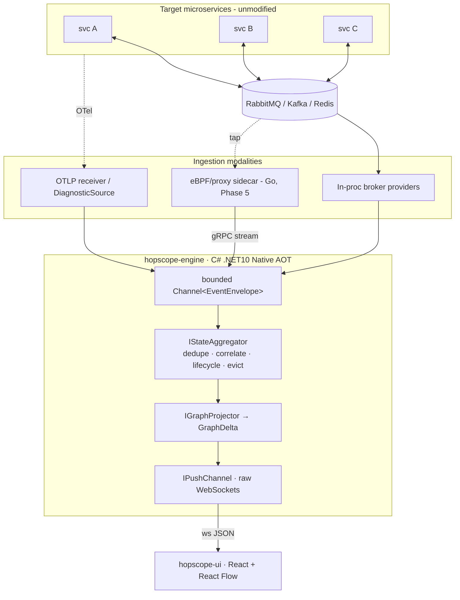

# Architecture Plan — Visual Event-Stream Debugger ("Hopscope")

> Working codename **Hopscope** used throughout for concrete naming. Greenfield, standalone — unrelated to the Paideia SaaS that shares this repo folder.

## Context

We are building a lightweight, **real-time visual debugger for asynchronous message flows** across microservices. It maps dependencies, message propagation, and errors onto an interactive canvas **without intrusive code changes** to target services. It ships as a **microscopic OCI container** (`<60 MB` image, `<35 MB` idle RAM, sub-second boot) for local `docker compose` sprints and production K8s/ECS.

**Why now / intended outcome:** async systems are opaque — a request fans out across queues/topics/exchanges and a failure 3 hops downstream is near-impossible to trace from logs alone. Hopscope gives developers a live topology + per-trace lifecycle view, fed by low-overhead taps, so they can *see* propagation and pinpoint where a trace died.

**Decisions locked:**
1. **Core engine + push server → C# .NET 10 Native AOT** (honors team's .NET expertise; verified to hit the footprint targets).
2. **Real-time push → raw `System.Net.WebSockets`** (fully AOT-supported, lightest, full protocol control).
3. **eBPF / kernel-level no-touch capture → Phase-5 fast-follow**, not day-1. v1 ships with broker-native API + OTel ingestion (the spec's stated *default*). The eBPF agent later plugs into the **same `IEventIngestor` seam** as an out-of-process Go/Rust sidecar.
4. **Workspace → standalone repo**, not inheriting any other project's conventions — notably not the "FastEndpoints only" rule from prior projects, since FastEndpoints is reflection-heavy and **not AOT-compatible**; Hopscope uses Minimal APIs only.

All facts below were verified against Microsoft Learn for `aspnetcore-10.0` / `dotnet/core` (not assumed).

---


## 1. Language & Ingestion Feasibility Verdict

**Verdict: C# .NET 10 Native AOT is the correct core. Reject C# for exactly one layer — kernel-side eBPF — which becomes an optional out-of-process Go sidecar. Everything else is C#.**

### 1a. What's verified-viable in C# AOT

| Capability | AOT status (verified) | Use in Hopscope |
|---|---|---|
| `System.Net.WebSockets` | ✅ Fully supported | **Push server** (chosen) |
| gRPC server | ✅ Fully supported | **Agent → engine** ingress (Phase 5) |
| Minimal APIs (source-gen RDG) | ✅ Supported | Control-plane REST (`/healthz`, snapshot, config) |
| `System.Text.Json` source-gen | ✅ Required | All serialization (WS frames, REST) |
| Native image size | MS SignalR-AOT sample = **10.9 MB** Linux binary | On `runtime-deps:10.0-*-chiseled` → **~20-30 MB total image** ✅ |

### 1b. Hard AOT constraints that SHAPE the design (non-negotiable)

- **No MVC / no controllers** (`MVC` is ❌ under AOT). Also rules out reflection-heavy frameworks like **FastEndpoints** — the engine uses **Minimal APIs only**. *(This is a deliberate departure from the Paideia FastEndpoints habit; it does not apply here.)*
- **No runtime plugin loading** (`Assembly.LoadFile`, `Reflection.Emit` forbidden). ⇒ The broker-agnostic Provider Pattern is **compile-time registered**, not hot-loaded DLLs. Adding a broker = add a class + one DI line + recompile. (Still a clean seam; just not dynamic.)
- **JSON must be source-generated** (`JsonSerializerContext`). No reflection-based STJ. Every wire type is declared on `AppJsonSerializerContext`.
- **`InvariantGlobalization=true`** to use the smallest chiseled-aot base (no ICU/tzdata). Fine — Hopscope deals in ASCII identifiers + UTC timestamps.
- **`System.Linq.Expressions` runs interpreted** (slower) ⇒ no expression trees in the hot path. Hand-written correlation, not LINQ-over-Expression.
- **Push transport note:** SignalR *does* work under AOT (since .NET 9) but is **JSON-only + no strongly-typed hubs**. We chose raw WebSockets anyway — lighter and we own the delta protocol. SignalR remains a drop-in fallback if auto-reconnect/groups are later wanted.

### 1c. The one rejection: kernel-level eBPF

C# has **no mature managed eBPF story**. P/Invoke to `libbpf` works under AOT, but the *kernel-side* program is not C#-authorable, and you forfeit CO-RE/BTF/ring-buffer ergonomics. Gold-standard stacks: **Go `cilium/ebpf`** (recommended — pure-Go loader, no libbpf dep, de-facto standard) or **Rust `aya`** (max safety/perf, kernel + userspace in Rust; the upgrade path if line-rate production sniffing is ever needed).

**Why this isn't a problem:** the spec's *default* ingestion is broker-native APIs + OTel — all AOT-friendly C#. eBPF is the opt-in "no-code" extreme. We isolate it to a sidecar that emits the **same normalized contract** over gRPC, so the engine never knows or cares whether an envelope came from an in-process provider or the agent.

### 1d. Per-modality ingestion feasibility

| Ingestion modality | Where it runs | Language | AOT note |
|---|---|---|---|
| RabbitMQ Management API / firehose | In-process provider | C# | HTTP+JSON via `HttpClient` + STJ source-gen — safest AOT path |
| Redis Keyspace Notifications | In-process provider | C# | Prefer a thin RESP pub/sub client; verify `StackExchange.Redis` AOT-compat or shim |
| Kafka consumer / interceptor metadata | In-process provider | C# | `Confluent.Kafka` wraps native librdkafka (P/Invoke is AOT-OK); verify wrapper trims clean |
| OTLP receiver (OpenTelemetry) | In-process gRPC service | C# | gRPC ✅ + protobuf source-gen — fully AOT-safe; **lowest-friction universal tap** |
| .NET `DiagnosticSource` shim (decoupled SDK) | In target service | C# lib | Optional drop-in; forwards metadata to engine, non-blocking |
| **eBPF / deep proxy (no-code)** | **Sidecar agent** | **Go** | Phase 5; streams normalized envelopes over gRPC |

---

## 2. System Topology

### ASCII (authoritative)

```
                          TARGET MICROSERVICES (unmodified)
                ┌─────────┐     ┌─────────┐     ┌─────────┐
                │  svc A  │     │  svc B  │     │  svc C  │
                └────┬────┘     └────┬────┘     └────┬────┘
                     │ publish/consume via brokers   │
                     ▼               ▼               ▼
                ┌──────────────────────────────────────────┐
                │  MESSAGE BROKERS (RabbitMQ / Kafka / Redis)│
                └──────────────────────────────────────────┘
        ┌──────────────────┬──────────────────┬───────────────────────┐
        │ (A) broker-native│ (B) decoupled SDK│ (C) NO-CODE (Phase 5)  │
        │     API tap      │  DiagnosticSource│  eBPF / proxy sidecar  │
        │   [in-process]   │  /OTel [in target]│   [Go, out-of-process] │
        └────────┬─────────┴─────────┬────────┴──────────┬────────────┘
                 │ EventEnvelope     │ OTLP/gRPC          │ gRPC stream
                 ▼                   ▼                    ▼
   ╔══════════════════════════ CONTAINER: hopscope-engine (C# .NET10 AOT) ══════════════════════════╗
   ║  IEventIngestor providers ──►  bounded Channel<EventEnvelope>  (back-pressure, single-writer)    ║
   ║                                          │                                                       ║
   ║                                          ▼                                                       ║
   ║                         IStateAggregator  (lock-free, single consumer)                           ║
   ║                 • HopId dedupe (idempotent)  • TraceId → causal tree via ParentHopId             ║
   ║                 • per-hop lifecycle state machine  • TTL/window eviction (RAM cap)               ║
   ║                                          │ AggregationResult                                     ║
   ║                                          ▼                                                       ║
   ║                         IGraphProjector  ──►  GraphDelta (monotonic Sequence)                    ║
   ║                                          │                                                       ║
   ║                         IPushChannel (raw System.Net.WebSockets)                                 ║
   ║                    snapshot on connect ──► delta stream ──► gap-detect → re-snapshot             ║
   ╚══════════════════════════════════════════│═════════════════════════════════════════════════════╝
                                               │ ws://  (JSON, STJ source-gen)
                                               ▼
                          ┌──────────────────────────────────────────┐
                          │ CONTAINER: hopscope-ui (React + React Flow)│
                          │  dynamic nodes (svc/exchange/topic/queue)   │
                          │  dynamic edges (hops, colored by status)    │
                          └──────────────────────────────────────────┘
```

### Mermaid (same model)



**Deployment:** `engine` + `ui` are two tiny containers (the engine can also serve the built UI as static files to ship a single image). The `agent` (Phase 5) deploys as a **K8s DaemonSet / compose sidecar** with `CAP_BPF`+`CAP_NET_ADMIN`; engine and UI stay rootless, read-only FS, dropped caps.

---

## 3. Directory & Module Structure

Monorepo. Engine follows **Clean Architecture** (Domain ← Application ← Infrastructure ← Host); dependencies point inward only.

```
hopscope/
├─ contracts/
│  └─ proto/event.proto                  # SINGLE SOURCE OF TRUTH for the cross-language seam
├─ src/
│  ├─ engine/                            # C# .NET 10 Native AOT
│  │  ├─ Hopscope.Domain/               # zero deps: contract + topology + smart enums
│  │  │  ├─ Events/{EventEnvelope,ExecutionStatus,ErrorDetails}.cs
│  │  │  ├─ Topology/{GraphNode,GraphEdge,GraphDelta,GraphSnapshot,NodeKind}.cs
│  │  │  └─ Tracing/{TraceView,HopNode}.cs
│  │  ├─ Hopscope.Application/          # ports + use-case logic, no I/O
│  │  │  ├─ Abstractions/{IEventIngestor,IBrokerProvider,IStateAggregator,
│  │  │  │                IGraphProjector,IPushChannel,IngestionSource}.cs
│  │  │  ├─ Aggregation/StateAggregator.cs        # the lock-free single-writer core
│  │  │  └─ Projection/GraphProjector.cs
│  │  ├─ Hopscope.Infrastructure/       # adapters (compile-time registered)
│  │  │  ├─ Providers/{RabbitMq,Kafka,Redis,Otlp}/   # one folder per IBrokerProvider
│  │  │  ├─ Agent/RemoteAgentIngestor.cs           # gRPC server → IEventIngestor (Phase 5)
│  │  │  └─ Serialization/AppJsonSerializerContext.cs
│  │  ├─ Hopscope.Push/                 # raw WebSocket hub + snapshot/delta protocol
│  │  └─ Hopscope.Host/                 # CreateSlimBuilder, DI, Minimal API control-plane
│  │     ├─ Program.cs                   # PublishAot=true, InvariantGlobalization=true
│  │     └─ Dockerfile                   # sdk:10.0-noble-aot → runtime-deps:10.0-noble-chiseled
│  ├─ agent/                             # Phase 5 — Go (cilium/ebpf); not in v1
│  │  ├─ cmd/agent/main.go
│  │  ├─ internal/{ebpf,proxy,normalize,transport}/
│  │  └─ Dockerfile                      # scratch / distroless static binary
│  └─ ui/                                # React 19 + React Flow + TS
│     ├─ src/{canvas,ws-client,store,components}/
│     ├─ Dockerfile                      # node:22-alpine multi-stage (mirrors Paideia-Front)
│     └─ ...
├─ deploy/
│  ├─ docker-compose.yml                 # engine + ui + sample RabbitMQ for local sprints
│  └─ k8s/{engine-deployment,ui-deployment,agent-daemonset,service}.yaml
└─ pipelines/                            # Azure DevOps YAML (mirror Paideia build-template.yml)
```

---

## 4. Core Interfaces & Abstract Types

### 4a. The unified contract — `Hopscope.Domain` (AOT-friendly records)

```csharp
namespace Hopscope.Domain.Events;

public enum ExecutionStatus { Success, Retrying, DeadLettered, Failed }

public sealed record ErrorDetails(string ExceptionType, string Message, string? TruncatedStackTrace);

/// The normalized envelope EVERY ingestor MUST emit before touching the engine.
public sealed record EventEnvelope
{
    public required string TraceId { get; init; }                 // global correlation id
    public required string HopId { get; init; }                   // unique per message instance (dedupe key)
    public string? ParentHopId { get; init; }                     // upstream hop that caused this
    public required string Source { get; init; }                  // originating component
    public required string Destination { get; init; }             // exchange / topic / queue
    public required string BrokerType { get; init; }              // "RabbitMQ" | "Kafka" | "Redis" | ...
    public IReadOnlyDictionary<string, string> PayloadMetadata    // headers/routing keys/type names ONLY
        { get; init; } = new Dictionary<string, string>();        // NEVER message bodies (RAM guard)
    public required DateTimeOffset Timestamp { get; init; }       // UTC at interception
    public required ExecutionStatus ExecutionStatus { get; init; }
    public ErrorDetails? ErrorDetails { get; init; }              // non-null iff Failed
}
```

### 4b. Topology projection types — `Hopscope.Domain.Topology`

```csharp
namespace Hopscope.Domain.Topology;

public enum NodeKind { Service, Exchange, Topic, Queue }

public sealed record GraphNode(string Id, NodeKind Kind, string Label, string BrokerType);
public sealed record GraphEdge(string Id, string SourceId, string TargetId,
                               ExecutionStatus LastStatus, long Count);

/// Incremental update pushed to the UI. Sequence is monotonic for client gap-detection.
public sealed record GraphDelta(IReadOnlyList<GraphNode> UpsertNodes,
                                IReadOnlyList<GraphEdge> UpsertEdges, long Sequence);

/// Full topology handed to late-joining clients before they start consuming deltas.
public sealed record GraphSnapshot(IReadOnlyList<GraphNode> Nodes,
                                   IReadOnlyList<GraphEdge> Edges, long Sequence);
```

### 4c. The ports — `Hopscope.Application.Abstractions` (the Provider Pattern seam)

```csharp
namespace Hopscope.Application.Abstractions;

/// Config describing one configured tap (compile-time providers, runtime config).
public sealed record IngestionSource(string BrokerType, string ConnectionString,
                                     IReadOnlyDictionary<string, string> Options);

/// A running source of normalized envelopes. In-process providers AND the remote
/// agent's gRPC receiver implement this identically — the engine can't tell them apart.
public interface IEventIngestor
{
    string Name { get; }
    IAsyncEnumerable<EventEnvelope> StreamAsync(CancellationToken ct);
}

/// Broker-agnostic factory. ADD A BROKER = implement this + register in DI. Nothing else changes.
public interface IBrokerProvider
{
    string BrokerType { get; }                       // "RabbitMQ"
    bool CanHandle(IngestionSource source);
    IEventIngestor CreateIngestor(IngestionSource source);
}

public readonly record struct AggregationResult(bool IsNew, bool IsDuplicate, string TraceId);

/// In-memory correlation core. Single-writer; fed by one bounded Channel<EventEnvelope>.
public interface IStateAggregator
{
    ValueTask<GraphDelta?> IngestAsync(EventEnvelope evt, CancellationToken ct);  // idempotent on HopId
    GraphSnapshot Snapshot();                         // for late-joining UI clients
    TraceView? GetTrace(string traceId);              // drill-down: full causal tree of one trace
}

/// Turns an aggregator state change into UI-shaped node/edge upserts.
public interface IGraphProjector
{
    GraphDelta Project(EventEnvelope evt, AggregationResult result);
}

/// Fans deltas to connected UI clients (raw System.Net.WebSockets impl).
public interface IPushChannel
{
    ValueTask BroadcastAsync(GraphDelta delta, CancellationToken ct);
    ValueTask SendSnapshotAsync(string connectionId, GraphSnapshot snapshot, CancellationToken ct);
}
```

### 4d. Serialization context (AOT-mandatory) — `Hopscope.Infrastructure.Serialization`

```csharp
[JsonSourceGenerationOptions(PropertyNamingPolicy = JsonKnownNamingPolicy.CamelCase)]
[JsonSerializable(typeof(GraphDelta))]
[JsonSerializable(typeof(GraphSnapshot))]
[JsonSerializable(typeof(EventEnvelope))]
internal sealed partial class AppJsonSerializerContext : JsonSerializerContext;
```

### 4e. Cross-language seam — `contracts/proto/event.proto` (Phase 5 agent ↔ engine)

```proto
syntax = "proto3";
package hopscope.v1;
import "google/protobuf/timestamp.proto";

enum ExecutionStatus { SUCCESS = 0; RETRYING = 1; DEAD_LETTERED = 2; FAILED = 3; }
message ErrorDetails { string exception_type = 1; string message = 2; string truncated_stack_trace = 3; }

message EventEnvelope {
  string trace_id = 1; string hop_id = 2; string parent_hop_id = 3;   // empty == null
  string source = 4; string destination = 5; string broker_type = 6;
  map<string, string> payload_metadata = 7;
  google.protobuf.Timestamp timestamp = 8;
  ExecutionStatus execution_status = 9;
  ErrorDetails error_details = 10;                                     // unset == null
}

// Agent → Engine. Client-streaming for back-pressure-friendly high throughput.
service Ingestion { rpc Stream(stream EventEnvelope) returns (IngestAck); }
message IngestAck { uint64 accepted = 1; uint64 deduped = 2; }
```

### 4f. Aggregator design note (the load-bearing component)

- **Single-writer, lock-free.** All `IEventIngestor`s write into one `Channel<EventEnvelope>` (bounded → back-pressure). One consumer task owns all mutable state — no locks, AOT-trivial, predictable RAM.
- **Idempotency:** `HopId` set/bloom dedupe (matches the team's idempotency discipline). Duplicate hops are no-ops.
- **Correlation:** `TraceId → TraceView`; `ParentHopId` builds the causal tree; edges aggregate `Count` + `LastStatus`.
- **RAM cap (the <35 MB lever):** time-window + LRU eviction of whole traces. Metadata-only payloads (enforced by contract). Workstation GC + `InvariantGlobalization`. *Honest caveat:* `<35 MB` idle is achievable for an AOT workstation-GC app; under load, RSS scales with retained-trace window — the eviction window is the tuning knob, and Go would idle a few MB lower with less effort.

---

## 5. Step-by-Step Implementation Roadmap

| Phase | Deliverable | Exit gate |
|---|---|---|
| **0 — Contract & skeleton** | `event.proto`, `Hopscope.Domain` records, `AppJsonSerializerContext`, solution scaffold, chiseled-aot `Dockerfile`, Azure DevOps pipeline mirroring `build-template.yml` | `dotnet publish -c Release /p:PublishAot=true` is **warning-free**; image **< 60 MB** |
| **1 — Engine core (no real brokers)** | `Channel`-fed `StateAggregator` (dedupe/correlate/lifecycle/evict), `GraphProjector`, raw-WebSocket `IPushChannel` + snapshot/delta protocol, a `FakeIngestor` replaying synthetic envelopes | Synthetic stream renders a live, evolving graph; unit tests green for dedupe + correlation + eviction |
| **2 — First real provider (RabbitMQ, the default)** | `RabbitMqProvider` via Management API/firehose → `EventEnvelope`; verify chosen client trims clean under AOT | Real RabbitMQ traffic appears on a JSON snapshot in `docker compose` |
| **3 — Frontend canvas** | React + React Flow, WS client, snapshot+delta reducer, node/edge render by `NodeKind`/`ExecutionStatus`, trace highlight, error surfacing | **End-to-end**: real RabbitMQ → engine → live UI in the browser |
| **4 — Provider breadth** | `RedisProvider` (keyspace), `KafkaProvider` (consumer), `OtlpReceiver` (gRPC) behind `IBrokerProvider` | Multi-broker topology on one canvas; **adding each broker touched only its own folder** (proves the seam) |
| **5 — No-code agent (polyglot, opt-in)** | Go (`cilium/ebpf`) sidecar: proxy sniffer first → eBPF socket capture; normalize → gRPC client-stream → `RemoteAgentIngestor` | Capture a service with **zero code changes and no broker-API access**; envelopes indistinguishable from in-proc providers |
| **6 — Harden & ship** | Back-pressure tuning, **measured** RAM (<35 MB idle), K8s manifests (engine Deployment + agent DaemonSet), security (rootless, read-only FS, dropped caps; agent gets `CAP_BPF`/`CAP_NET_ADMIN`), self-observability | Footprint + load targets verified **with numbers**, not claims |

---


## Critical files to create (representative)

- `contracts/proto/event.proto` — cross-language contract (Phase 0/5)
- `src/engine/Hopscope.Domain/Events/EventEnvelope.cs` + `Topology/*.cs` — §4a/4b
- `src/engine/Hopscope.Application/Abstractions/*.cs` — the ports in §4c
- `src/engine/Hopscope.Application/Aggregation/StateAggregator.cs` — the single-writer core
- `src/engine/Hopscope.Push/WebSocketPushChannel.cs` — raw WS hub
- `src/engine/Hopscope.Infrastructure/Providers/RabbitMq/RabbitMqProvider.cs` — first real adapter
- `src/engine/Hopscope.Host/Program.cs` (+ `.csproj` with `PublishAot`, `InvariantGlobalization`) and `Dockerfile`
- `src/ui/src/canvas/*` + `src/ui/src/ws-client/*` — React Flow canvas + WS reducer
- `deploy/docker-compose.yml` — local sprint env

## Verification (end-to-end)

1. **AOT gate:** `dotnet publish src/engine/Hopscope.Host -c Release /p:PublishAot=true` → must emit **zero** trim/AOT warnings (a single warning means a dependency isn't AOT-safe — swap it).
2. **Footprint gate:** `docker build` the engine on `runtime-deps:10.0-noble-chiseled`; assert image `< 60 MB` (`docker images`) and idle RSS `< 35 MB` (`docker stats` after boot).
3. **Synthetic E2E (Phase 1):** run engine with `FakeIngestor`; open UI; confirm nodes/edges spawn and statuses color correctly; kill a synthetic trace mid-flight and confirm a `Failed` edge.
4. **Real-broker E2E (Phase 3):** `docker compose up` (engine + ui + RabbitMQ); publish/consume test messages; confirm the live canvas matches the actual exchange→queue→consumer topology; verify a dead-lettered message surfaces as `DeadLettered` with `ErrorDetails`.
5. **Seam proof (Phase 4):** add Redis with traffic; confirm only `Providers/Redis/` was added and both brokers co-render.
6. **No-code proof (Phase 5):** point the agent at a service with no instrumentation and no broker creds; confirm its hops appear identically to in-proc providers.
```